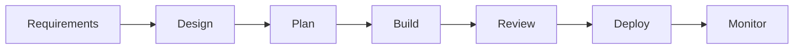

# AI Software Development Manifesto

This repo packages a pragmatic AI-assisted engineering workflow:

- Specs are durable contracts.
- `bd` (Beads) is the live task system.
- Codex runs a controller-led multi-agent loop for implementation and review.
- Work happens one task at a time in a single local checkout.
- Workflow rigor should match task risk.

This is intentionally stricter than "vibe coding". The goal is to keep the speed benefits of AI while preserving normal engineering controls: explicit decisions, bounded tasks, verification, review, and coherent commits.

The `/spec`, `/implement-task`, `/review-task`, `/bugfix-fast-path`, `/workflow-triage`, and `/conventional-commit` names in this repo are workflow labels backed by skill/runbook files.

## Workflow

### 1. `/workflow-triage`

Classify the request before starting work:

- trivial fix → direct change
- bug fix → `/bugfix-fast-path`
- small or complex feature → `/spec`
- approved Beads task → `/implement-task`

Detailed runbook: [skills/shared-ai/commands/workflow-triage.md](skills/shared-ai/commands/workflow-triage.md)

### 2. `/spec`

Draft a spec under `.ai/specs/<slug>.md` using [skills/shared-ai/templates/spec.md](skills/shared-ai/templates/spec.md). Directory guidance lives in [skills/shared-ai/specs/README.md](skills/shared-ai/specs/README.md).

The spec is the durable source of truth for:

- why the change exists
- what is in scope
- what must not happen
- technical decisions and constraints
- security, data, rollout, and rollback impact
- validation expectations

After human review and approval, convert the approved work into `bd` issues. Do not maintain the task list in markdown after that point.

Detailed runbook: [skills/shared-ai/commands/spec.md](skills/shared-ai/commands/spec.md)

### 3. `/implement-task`

Implement exactly one approved Beads task at a time.

The controller agent owns the session and:

- claims the task
- loads the linked spec
- coordinates an implementer agent when the task benefits from delegation
- requests a fresh review from a separate reviewer agent when subagent support is available
- applies or directs fixes
- reruns verification
- records verification evidence in Beads
- updates and closes the Beads task

Detailed runbook: [skills/shared-ai/commands/implement-task.md](skills/shared-ai/commands/implement-task.md)

### 4. `/review-task`

Run a fresh-context review of one task, patch, or diff when review is needed without mixing it into implementation.

Detailed runbook: [skills/shared-ai/commands/review-task.md](skills/shared-ai/commands/review-task.md)

### 5. `/bugfix-fast-path`

Handle a bounded bug fix with the minimum safe workflow:

- clarify the failure
- implement the smallest effective fix
- verify
- review
- verify again
- commit

Detailed runbook: [skills/shared-ai/commands/bugfix-fast-path.md](skills/shared-ai/commands/bugfix-fast-path.md)

### 6. `/conventional-commit`

Once the task or bug fix is complete and verified, commit with the `conventional-commit` skill. Keep commits small, task-scoped, and traceable to the relevant Beads issue when applicable.

Workflow note: [skills/shared-ai/commands/conventional-commit.md](skills/shared-ai/commands/conventional-commit.md)

## Files

- [AGENTS.md](AGENTS.md): repo-level operating rules for Codex
- [DECISION-FRAMEWORK.md](DECISION-FRAMEWORK.md): how to choose the right rigor level
- [skills/shared-ai/templates/spec.md](skills/shared-ai/templates/spec.md): durable spec template
- [skills/shared-ai/specs/README.md](skills/shared-ai/specs/README.md): where approved specs live
- [skills/shared-ai/reference/codex-multi-agent.md](skills/shared-ai/reference/codex-multi-agent.md): subagent definitions and command mappings
- [skills/shared-ai/commands/workflow-triage.md](skills/shared-ai/commands/workflow-triage.md): routing runbook
- [skills/shared-ai/commands/spec.md](skills/shared-ai/commands/spec.md): draft-and-translate runbook
- [skills/shared-ai/commands/implement-task.md](skills/shared-ai/commands/implement-task.md): controller/implementer/reviewer runbook
- [skills/shared-ai/commands/review-task.md](skills/shared-ai/commands/review-task.md): review-only runbook
- [skills/shared-ai/commands/bugfix-fast-path.md](skills/shared-ai/commands/bugfix-fast-path.md): lightweight bugfix runbook
- [skills/shared-ai/commands/conventional-commit.md](skills/shared-ai/commands/conventional-commit.md): commit handoff notes
- [skills/workflow-triage/SKILL.md](skills/workflow-triage/SKILL.md): skill form of `/workflow-triage`
- [skills/spec-to-beads/SKILL.md](skills/spec-to-beads/SKILL.md): skill form of `/spec`
- [skills/implement-bead-task/SKILL.md](skills/implement-bead-task/SKILL.md): skill form of `/implement-task`
- [skills/review-task/SKILL.md](skills/review-task/SKILL.md): skill form of `/review-task`
- [skills/bugfix-fast-path/SKILL.md](skills/bugfix-fast-path/SKILL.md): skill form of `/bugfix-fast-path`
- [skills/conventional-commit/SKILL.md](skills/conventional-commit/SKILL.md): skill form of `/conventional-commit`

## Design Choices

- The spec stays in the repo because decisions need durable history.
- Tasks live in `bd` because status, dependencies, claiming, and acceptance criteria are operational state.
- The controller/implementer/reviewer split is deliberate. Generation and review are different tasks.
- Codex multi-agent support is documented explicitly in [skills/shared-ai/reference/codex-multi-agent.md](skills/shared-ai/reference/codex-multi-agent.md).
- Fresh context per task is mandatory. Long agent sessions degrade quality.
- No worktrees. Single-checkout discipline reduces local state complexity for solo task execution.
- Shared AI runbooks live under `skills/shared-ai/` so multiple skills can reference one source of truth.

## Rigor Scale

Workflow depth should match task complexity. See `DECISION-FRAMEWORK.md` for detailed guidance.

| Task Type | Workflow |
|-----------|----------|
| Trivial fix | Direct fix → `/conventional-commit` |
| Bug fix | `/bugfix-fast-path` |
| Small feature | `/spec` with lightweight contract → `/implement-task` |
| Complex feature | `/spec` with constraints and rollout notes → `/implement-task` |
| Approved task | `/implement-task` |

**One rule always applies:** Clearer instructions produce better output, regardless of task size.

## AI Throughout the Lifecycle

The best engineers use AI at every stage, not just for code generation. This repo focuses on the spec-driven workflow for features and the disciplined fast path for bug fixes, but the same AI-assisted approach applies to requirements gathering, design, review, deployment, and monitoring.

## Sources That Informed This Repo

- Owain Lewis, "Stop Vibe Coding — How to Build Software With AI Like a Senior Engineer"
- Owain Lewis, "Spec-Driven Development"
- OpenAI Codex app and Codex cloud materials on multi-agent workflows, AGENTS.md, and task-queue usage
- Beads documentation for issue structure, dependencies, and agent-oriented task tracking
